# Mini ERP

A full-stack ERP system built for **Esemby Concept / Pita Bakery** in Singapore. Manages orders, production, inventory, procurement, and analytics for a food manufacturing plant with three production lines: Bakery, Salads, and Frozen.

Built with Next.js 16, TypeScript, Prisma, and Tailwind CSS.

## Screenshots

| | |
|---|---|
| 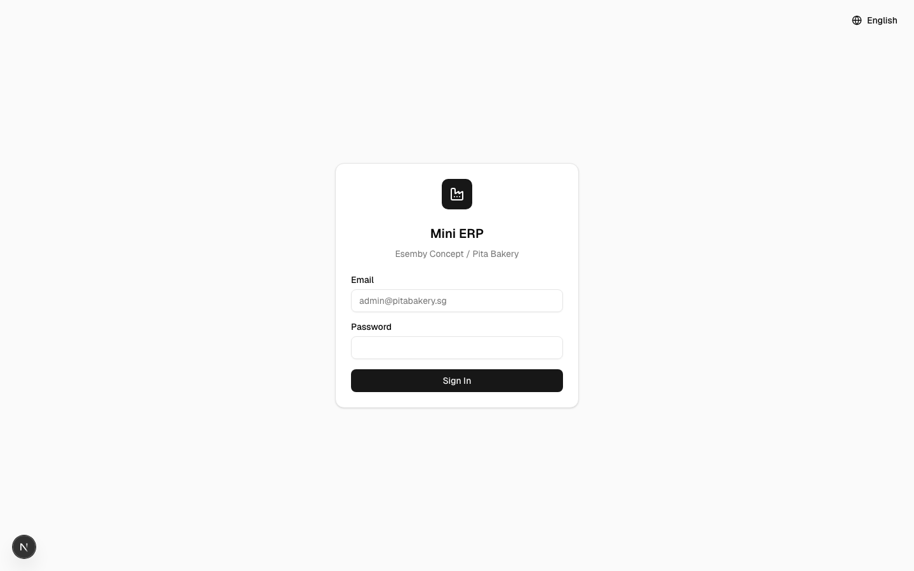 | 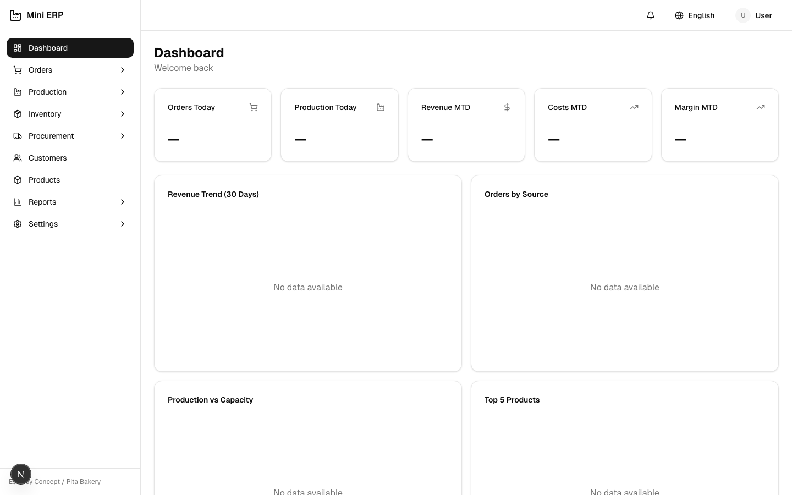 |
| **Login** | **Executive Dashboard** |
| 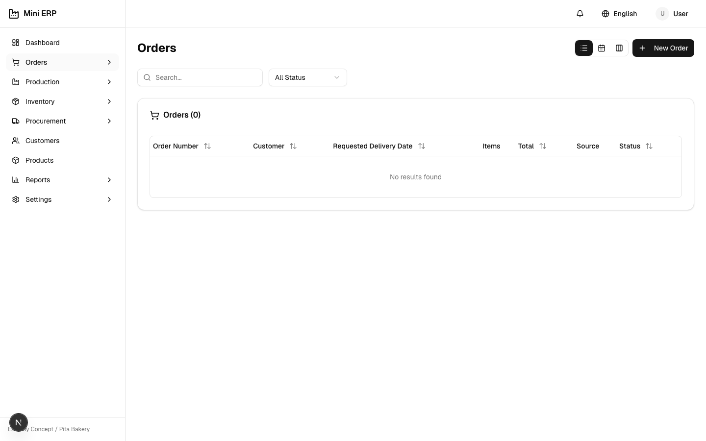 | 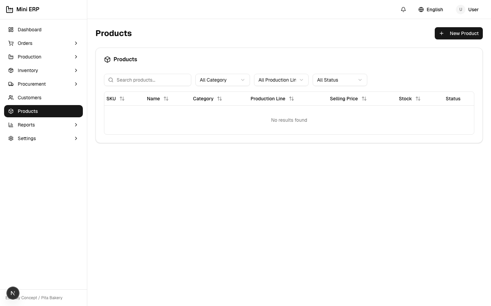 |
| **Orders** | **Products** |
| 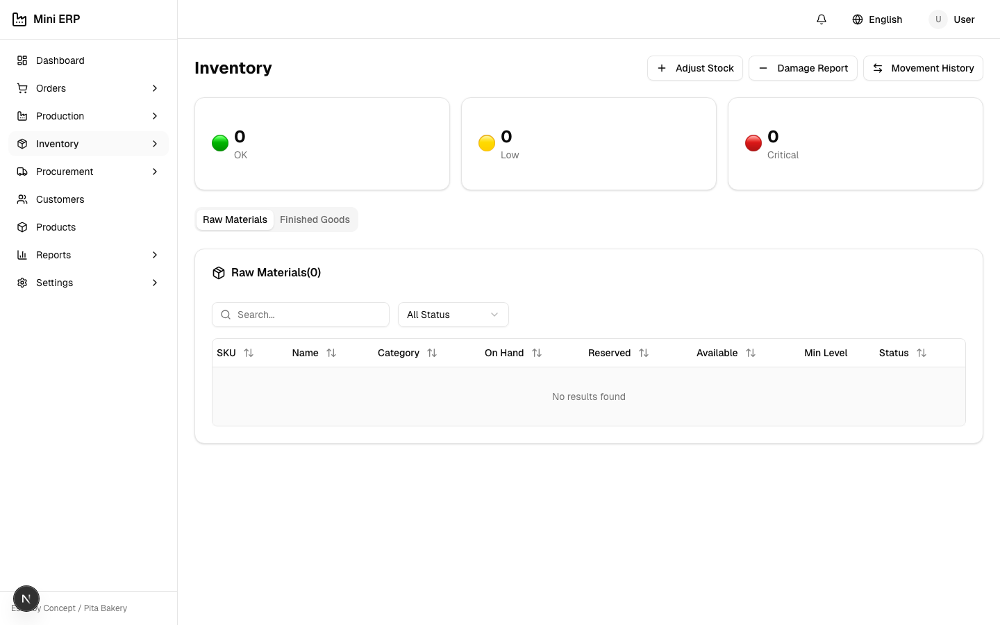 | 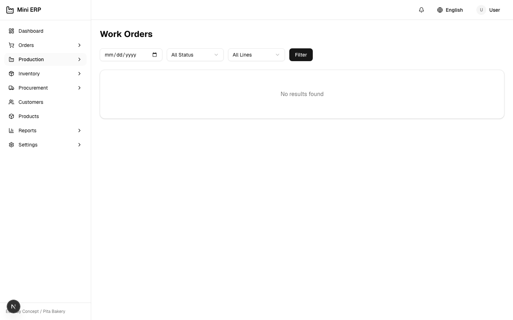 |
| **Inventory** | **Work Orders** |
| 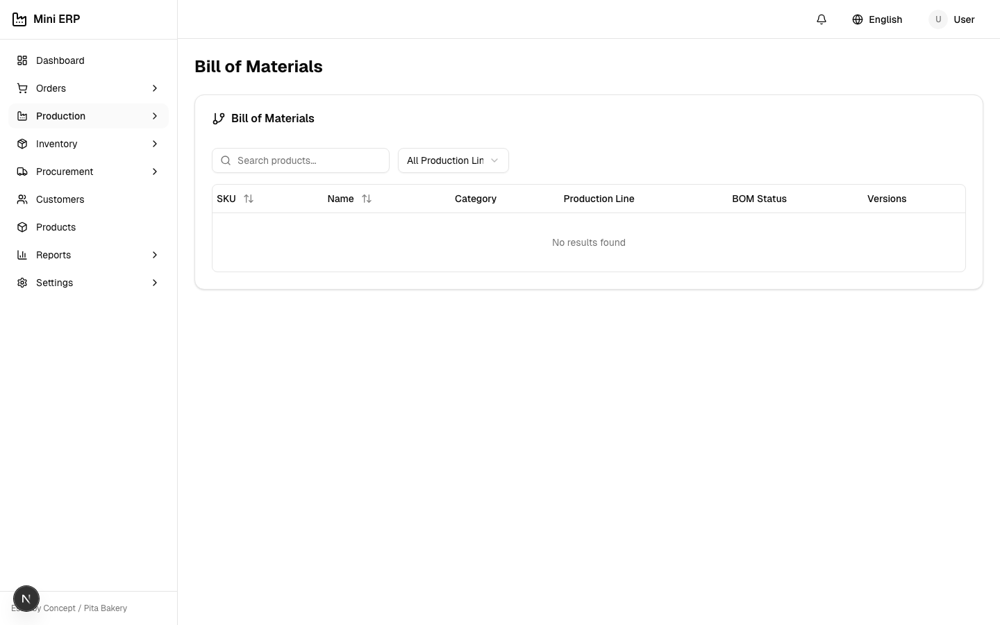 | 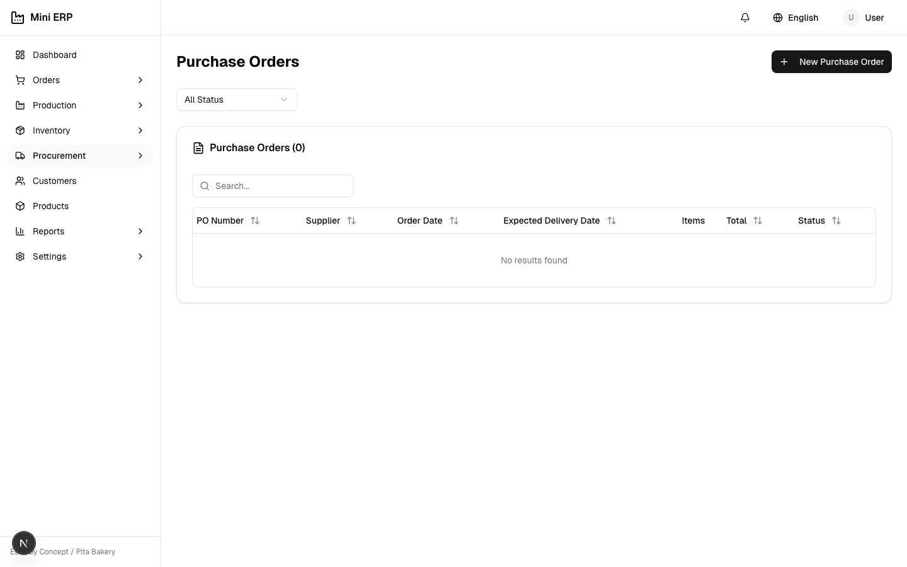 |
| **Bill of Materials** | **Procurement** |
|  | 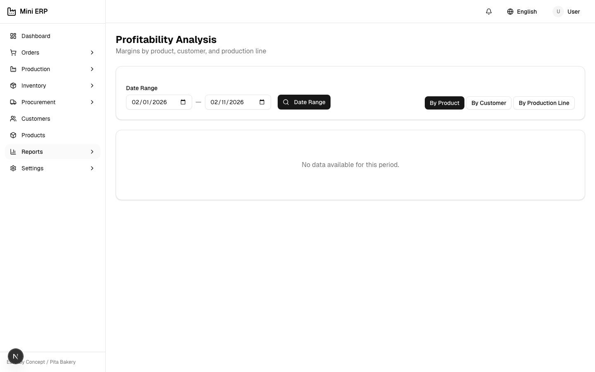 |
| **Customers** | **Profitability Reports** |
| 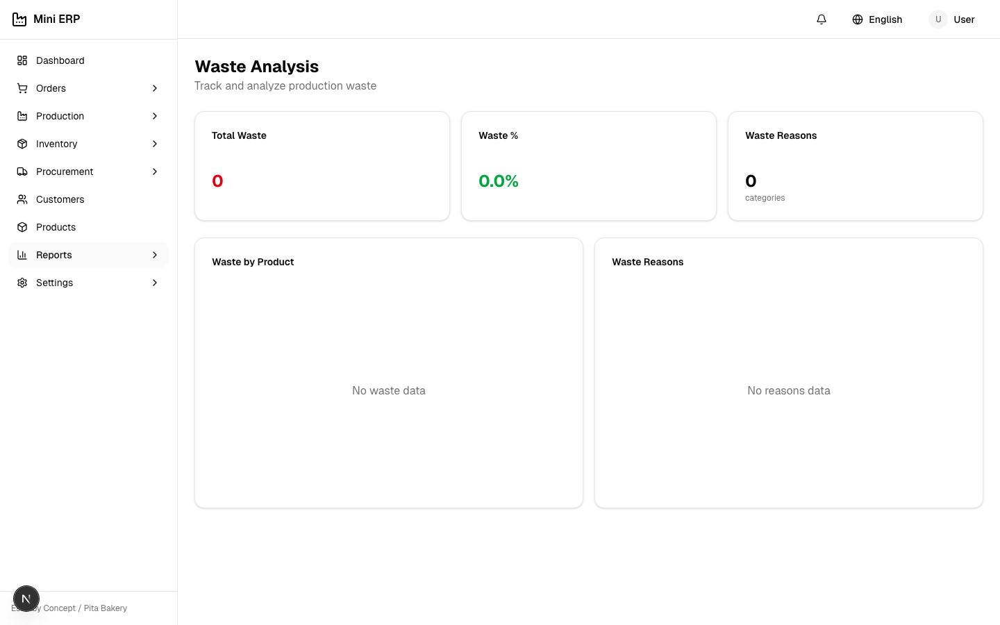 | 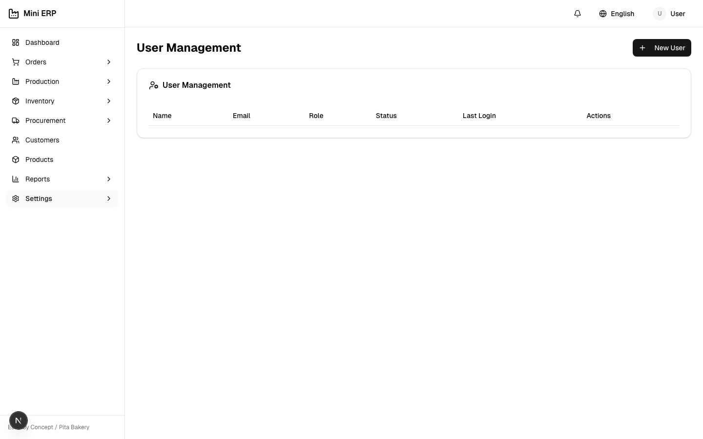 |
| **Waste Analysis** | **User Management** |
| 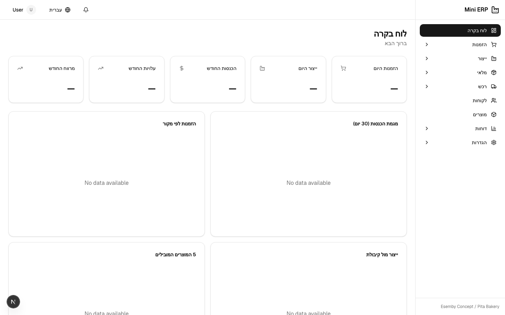 | 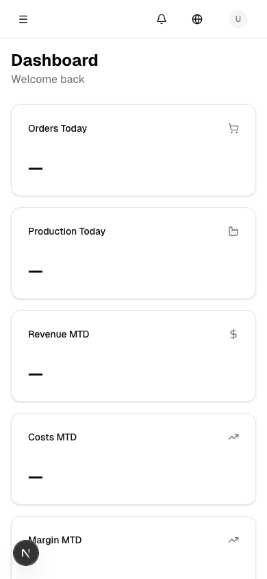 |
| **Hebrew (RTL)** | **Mobile View** |

## Features

### Orders & Customers
- Order CRUD with status workflow (Draft → Confirmed → In Production → Ready → Delivered)
- Order locking, duplication, and change history tracking
- AI-powered order parsing from email/WhatsApp (Claude API)
- CSV/Excel bulk import
- Customer management with delivery addresses and payment terms

### Production
- Bill of Materials (BOM) management with versioning
- Work order generation from confirmed orders
- Production planning with line capacity scheduling
- Production reporting (quantities, waste, batch tracking)
- Shelf life tracking and expiry alerts

### Inventory
- Real-time stock levels for raw materials and finished goods
- Stock movements (receive, adjust, transfer, production input/output)
- Cycle counting with approval workflow
- Damage write-offs with reason tracking
- Low stock alerts and reorder point monitoring

### Procurement
- Purchase order management with supplier tracking
- Auto-reorder suggestions based on stock levels and lead times
- Supplier delivery calendar
- Goods receiving with PO matching

### Integrations
- **SAP Ariba** - Procurement sync (purchase orders, goods receipts)
- **Xero** - Accounting sync (invoices, contacts, items)
- **FreshBooks** - Invoicing sync with revenue analytics and AR aging
- **WhatsApp** - Incoming order webhook

### Analytics & Reports
- Executive dashboard with KPI cards and charts (Recharts)
- Material variance analysis (expected vs actual usage)
- Profitability reports (by product, customer, production line)
- Production analytics (volume trends, waste analysis, capacity utilization)
- Customer analytics (Pareto analysis, order frequency, churn risk)

### Mobile & PWA
- Progressive Web App with offline support
- Factory Floor mode with large touch targets, high contrast, and auto-lock
- Responsive tables (card layout on mobile, table on desktop)
- Print layouts for production plans, POs, and count sheets

### Internationalization
- 4 languages: English, Hebrew (RTL), Chinese (Simplified), Malay
- 1,000+ translation keys per locale
- RTL layout support with CSS logical properties

### Auth & RBAC
- NextAuth.js with credentials provider and JWT sessions
- 6 roles: Admin, Manager, Production, Warehouse, Sales, Viewer
- Route-based permission checking

## Tech Stack

| Layer | Technology |
|-------|-----------|
| Framework | Next.js 16 (App Router) |
| Language | TypeScript 5 |
| Database | PostgreSQL (Supabase) |
| ORM | Prisma 6 |
| Auth | NextAuth.js 4 |
| Styling | Tailwind CSS 4 |
| Components | shadcn/ui + Radix UI |
| Charts | Recharts 3 |
| Forms | React Hook Form + Zod |
| i18n | next-intl |
| AI | Anthropic Claude SDK |
| Testing | Vitest |
| CI/CD | GitHub Actions |
| Hosting | Vercel (Singapore region) |

## Project Structure

```
mini-erp/
├── app/
│   ├── [locale]/
│   │   ├── (auth)/login/          # Login page
│   │   ├── (dashboard)/           # Main app pages
│   │   │   ├── orders/            # Order management
│   │   │   ├── production/        # BOM, work orders, planning
│   │   │   ├── inventory/         # Stock, movements, counts
│   │   │   ├── procurement/       # POs, suppliers, suggestions
│   │   │   ├── customers/         # Customer management
│   │   │   ├── products/          # Product catalog
│   │   │   ├── raw-materials/     # Raw material catalog
│   │   │   ├── reports/           # Analytics & reports
│   │   │   ├── settings/          # Users, notifications, integrations
│   │   │   └── page.tsx           # Executive dashboard
│   │   └── (floor)/floor/         # Factory floor mode
│   └── api/                       # 72 API routes
├── components/
│   ├── layout/                    # Sidebar, header, language switcher
│   ├── ui/                        # shadcn/ui components
│   ├── shared/                    # Data table, confirm dialog
│   ├── notifications/             # Notification center
│   ├── print/                     # Print layouts
│   └── pwa/                       # Install prompt, SW register
├── lib/
│   ├── ai/                        # Email/WhatsApp order parser
│   ├── integrations/              # Ariba, Xero, FreshBooks, WhatsApp
│   ├── services/                  # Business logic services
│   └── auth.ts, prisma.ts, ...    # Core utilities
├── prisma/
│   ├── schema.prisma              # 22 models, 9 enums
│   ├── migrations/                # Database migrations
│   └── seed.ts                    # Sample data
├── messages/                      # i18n (en, he, zh-CN, ms)
├── tests/unit/                    # 33 unit tests
├── scripts/                       # Import & backup scripts
└── .github/workflows/ci.yml       # CI pipeline
```

**42 pages | 72 API routes | 22 database models | 4 languages**

## Getting Started

### Prerequisites

- Node.js 20+
- PostgreSQL database

### Setup

```bash
# Install dependencies
npm install

# Set up environment variables
cp .env.example .env
# Edit .env with your DATABASE_URL and NEXTAUTH_SECRET

# Generate Prisma client
npx prisma generate

# Run database migration
npx prisma migrate dev

# Seed sample data
npx prisma db seed

# Start development server
npm run dev
```

Open [http://localhost:3000](http://localhost:3000).

### Seed Users

| Email | Password | Role |
|-------|----------|------|
| admin@pitabakery.sg | admin123 | Admin |
| manager@pitabakery.sg | manager123 | Manager |
| floor@pitabakery.sg | floor123 | Production |

## Scripts

```bash
npm run dev              # Start dev server
npm run build            # Production build
npm run lint             # Run ESLint
npm run typecheck        # TypeScript type checking
npm run test             # Run unit tests
npm run test:watch       # Run tests in watch mode
npm run test:coverage    # Run tests with coverage
npm run db:migrate       # Run Prisma migrations
npm run db:seed          # Seed database
npm run db:studio        # Open Prisma Studio
```

### Data Import

```bash
# Import data from CSV (supports --dry-run for validation)
npx tsx scripts/import-data.ts --type customers --file data/customers.csv
npx tsx scripts/import-data.ts --type products --file data/products.csv --dry-run
```

### Database Backup

```bash
./scripts/backup-db.sh   # Creates gzipped backup, cleans >30 days
```

## Deployment

Configured for **Vercel** with Singapore region (`sin1`).

The CI pipeline runs lint, typecheck, tests, and build on every push/PR to `main`.

## License

Private - Esemby Concept Pte Ltd.
